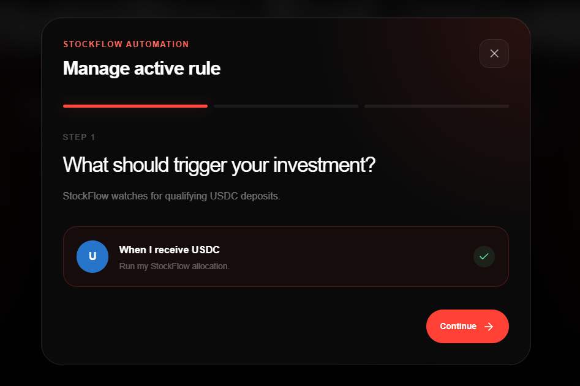
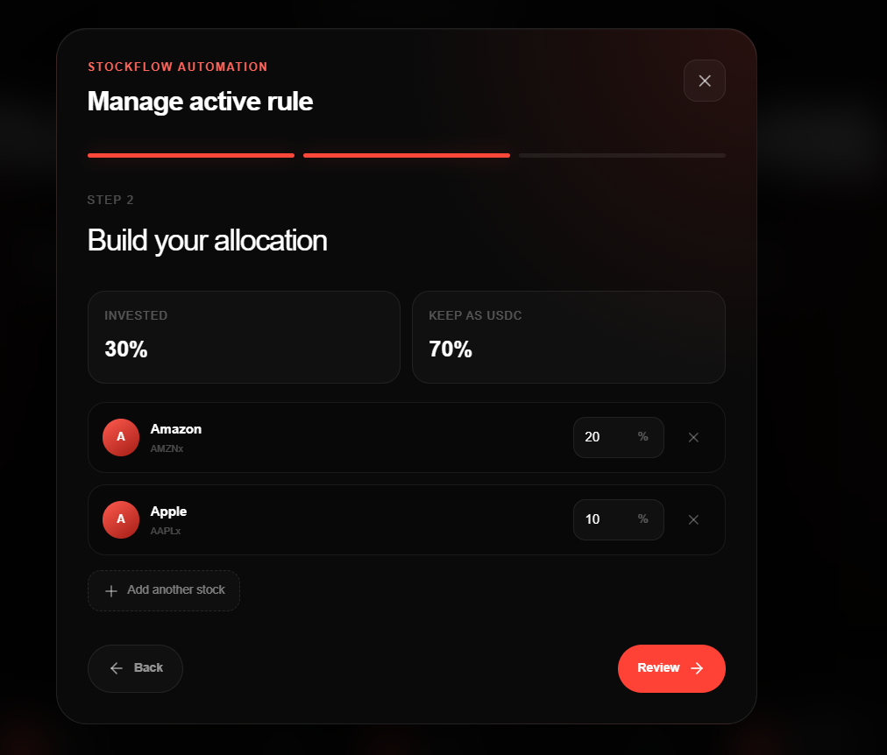
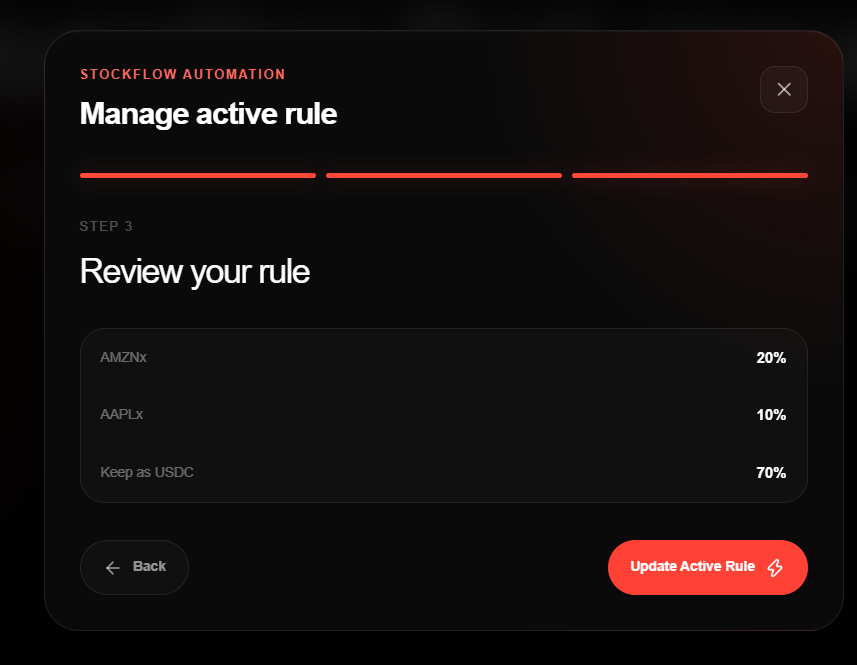
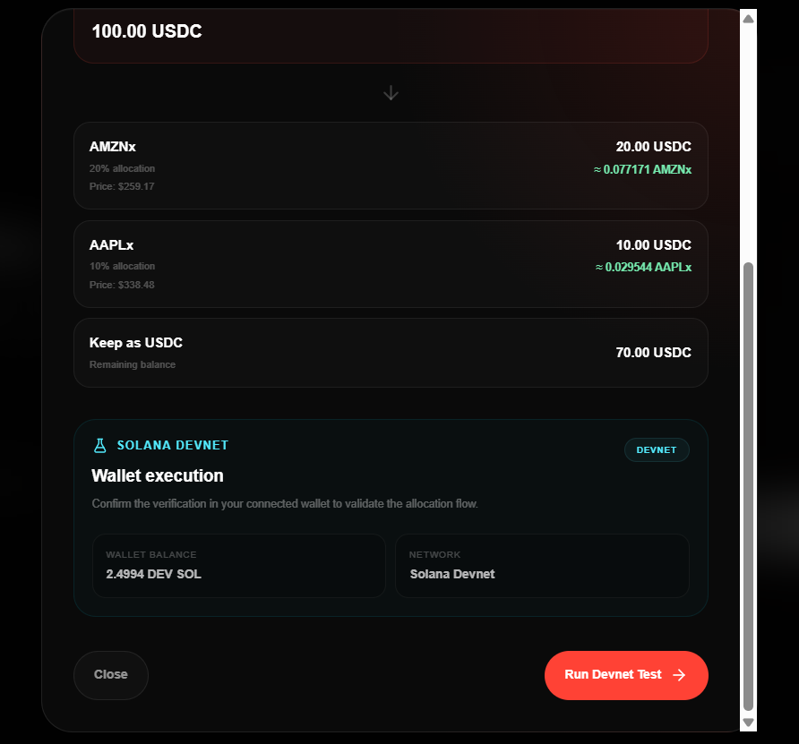
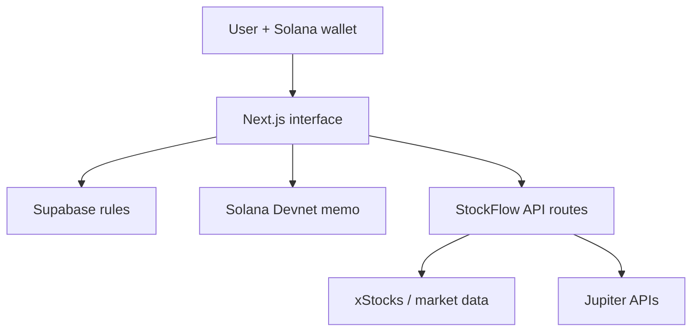

# StockFlow

**Automated tokenized-stock allocation on Solana.**

StockFlow lets a user connect a Solana wallet, create a reusable allocation rule for xStocks, simulate an incoming USDC deposit, and verify the flow safely on Solana Devnet.

Built for **Stocklana on Solana**.

[Live demo](https://stockflow-nine-indol.vercel.app) · [Architecture](docs/ARCHITECTURE.md) · [Security notes](SECURITY.md)

## Product preview

### Landing page


### Build and review an allocation rule

| Trigger | Allocation builder |
| --- | --- |
|  |  |



### Verify the flow on Solana Devnet



## The problem

Investors who regularly receive stablecoins must repeatedly decide what to buy and manually split every deposit. That process is slow, inconsistent, and difficult to verify before funds move.

## The solution

StockFlow turns an investment preference into a wallet-linked allocation rule:

1. Connect a Solana wallet.
2. Choose supported xStocks and allocation percentages.
3. Save a draft or activate the rule.
4. Enter an incoming USDC amount to preview the split.
5. Approve a Devnet verification transaction in the wallet.

The prototype demonstrates the rule-building and verification experience without taking custody of funds.

## Judge walkthrough

1. Open the [live demo](https://stockflow-nine-indol.vercel.app).
2. Connect a Solana wallet configured for **Devnet**.
3. Select **Start Investing** and create an allocation.
4. Save or activate the rule.
5. Select **Test Rule**, enter a USDC amount, and review the calculated distribution.
6. Run the Devnet test and approve the wallet prompt.
7. Review the wallet-specific rule and recent activity on the page.

> The Devnet action writes a verification memo. It does not execute stock purchases or move investment funds.

## Product features

- Solana wallet connection through Wallet Adapter
- Wallet-linked draft and active allocation rules
- Eight supported xStocks: AAPLx, NVDAx, TSLAx, AMZNx, MSFTx, METAx, NFLXx, and COINx
- Live price lookup with xStocks, Nasdaq, and Stooq fallbacks
- USDC allocation simulator
- Solana Devnet wallet verification
- Local activity history and cached market prices
- Jupiter route-preview API foundation
- Responsive, animated product interface

## Architecture



The browser owns the interactive wallet experience. Next.js route handlers proxy external market and routing services so server-only configuration stays off the client. Supabase stores allocation rules, while local storage provides a prototype fallback and activity history.

## API surface

| Method | Route | Purpose |
| --- | --- | --- |
| `GET` | `/api/xstocks` | Returns the supported assets and normalized prices |
| `POST` | `/api/jupiter-preview` | Checks USDC-to-xStock route availability without signing or submitting a transaction |

## Tech stack

- Next.js 16, React 19, TypeScript
- Solana Web3.js and Wallet Adapter
- Supabase
- Jupiter APIs
- xStocks, Nasdaq, and Stooq market-data sources
- Framer Motion and Tailwind CSS
- Vercel

## Local setup

### Requirements

- Node.js 20+
- npm
- A Supabase project
- A Solana wallet for the Devnet verification flow
- A Jupiter API key for route previews

### Install

```bash
git clone https://github.com/donatofaith/stockflow.git
cd stockflow
npm install
cp .env.example .env.local
npm run dev
```

Open [http://localhost:3000](http://localhost:3000).

### Environment variables

```env
NEXT_PUBLIC_SUPABASE_URL=
NEXT_PUBLIC_SUPABASE_PUBLISHABLE_KEY=
JUPITER_API_KEY=
```

The Supabase publishable key is intended for browser use. Never place a Supabase service-role key or wallet secret in a `NEXT_PUBLIC_*` variable.

## Development checks

```bash
npm run lint
npm run build
```

## Prototype boundaries

- Rule activation records a user preference; it does not run an autonomous trading service.
- The wallet verification uses Solana Devnet and a memo transaction.
- Jupiter integration currently prepares route information only; signing and execution are disabled.
- Market prices may be delayed or unavailable when third-party services are unreachable.
- Production use requires signed wallet authentication and restrictive Supabase Row Level Security policies.

## Author

Built by **Faith Oluwalana**.

## License

See [COPYRIGHT.md](COPYRIGHT.md).
