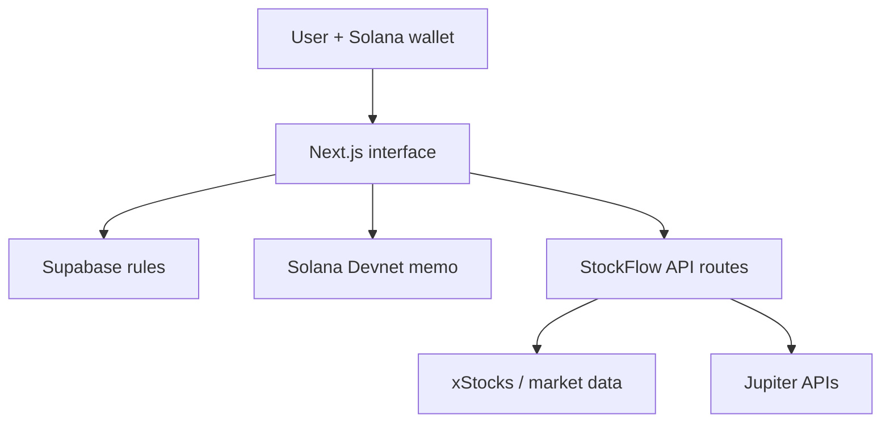

# StockFlow

**A simple allocation-rule prototype for tokenized stocks on Solana.**

StockFlow lets you connect a Solana wallet, decide how incoming USDC should be divided across supported xStocks, save that rule, and preview the result before confirming an optional Solana Devnet verification.

Built for **Stocklana on Solana**.

[Live demo](https://stockflow-nine-indol.vercel.app) · [Architecture](docs/ARCHITECTURE.md) · [Security notes](SECURITY.md)

## What StockFlow does

StockFlow turns one allocation decision into a reusable wallet-linked flow:

1. **Choose your split** — select supported xStocks, set percentages, and decide how much stays available as USDC.
2. **Review your rule** — check that the allocation is exactly what you want to save.
3. **Preview the result** — enter an example incoming USDC amount and see how the rule divides it.
4. **Return to My Flow** — review the saved rule and recent demo activity from one place.
5. **Optional Devnet verification** — record a verification memo on Solana Devnet.

The current prototype does **not** purchase stocks, move investment funds, or run autonomous trades.

## Product flow

```text
Connect wallet
     ↓
Create my flow
     ↓
Choose allocation
     ↓
Review + activate rule
     ↓
My Flow
     ↓
Preview an incoming USDC amount
     ↓
Optional Devnet verification
```

## Demo walkthrough

1. Open the live demo.
2. Connect a Solana wallet configured for Devnet.
3. Select **Start Investing** / **Create my flow**.
4. Choose the xStocks and percentages for the rule.
5. Review the allocation and select **Activate my flow**.
6. Open **My Flow** and select **Preview my flow**.
7. Enter an example USDC amount to see the calculated split.
8. Optionally select **Verify preview** and approve the Devnet wallet prompt.

> Devnet verification writes a memo transaction for the demo. It does not execute stock purchases or move investment funds.

## Supported assets

The prototype currently supports:

- AAPLx — Apple
- NVDAx — NVIDIA
- TSLAx — Tesla
- AMZNx — Amazon
- MSFTx — Microsoft
- METAx — Meta
- NFLXx — Netflix
- COINx — Coinbase

Any percentage not assigned to an xStock remains available as USDC.

## Product features

- Solana wallet connection through Wallet Adapter
- Wallet-linked draft and active allocation rules
- Eight supported xStocks
- Live market-price lookup with fallback providers
- USDC allocation preview
- My Flow view for the saved rule and recent demo activity
- Optional Solana Devnet verification
- Cached market prices and local activity history
- Jupiter route-preview API foundation
- Responsive interface

## Architecture


```mermaid
flowchart TD
    U["User + Solana wallet"] --> W["Next.js interface"]
    W --> S["Supabase rules"]
    W --> D["Solana Devnet memo"]
    W --> P["StockFlow API routes"]
    P --> X["xStocks / market data"]
    P --> J["Jupiter APIs"]
```

The browser owns the interactive wallet experience. Next.js route handlers proxy external market and routing services so server-only configuration stays off the client. Supabase stores allocation rules, while local storage provides a prototype fallback and activity history.

## API surface

| Method | Route | Purpose |
| --- | --- | --- |
| `GET` | `/api/xstocks` | Returns supported assets and normalized prices |
| `POST` | `/api/jupiter-preview` | Checks route availability without signing or submitting a transaction |

## Tech stack

- Next.js 16, React 19, TypeScript
- Solana Web3.js and Wallet Adapter
- Supabase
- Jupiter APIs
- xStocks, Nasdaq, and Stooq market-data sources
- Framer Motion and Tailwind CSS
- Vercel

## Local setup

### Requirements

- Node.js 20+
- npm
- A Supabase project
- A Solana wallet for the optional Devnet verification
- A Jupiter API key for route previews

### Install

```bash
git clone https://github.com/donatofaith/stockflow.git
cd stockflow
npm install
cp .env.example .env.local
npm run dev
```

Open `http://localhost:3000`.

### Environment variables

```env
NEXT_PUBLIC_SUPABASE_URL=
NEXT_PUBLIC_SUPABASE_PUBLISHABLE_KEY=
JUPITER_API_KEY=
```

The Supabase publishable key is intended for browser use. Never place a Supabase service-role key or wallet secret in a `NEXT_PUBLIC_*` variable.

## Development checks

```bash
npm run lint
npm run build
```

## Prototype boundaries

- Activating a flow saves a user preference; it does not start autonomous trading.
- Preview Flow is a calculation only; no investment funds are moved.
- Devnet verification uses a Solana memo transaction.
- Jupiter integration currently prepares route information only; signing and execution are disabled.
- Market prices may be delayed or unavailable when third-party services are unreachable.
- Production use would require additional authentication, security review, and restrictive Supabase Row Level Security policies.

## Author

Built by **Faith Oluwalana**.

## License

See [COPYRIGHT.md](COPYRIGHT.md).
