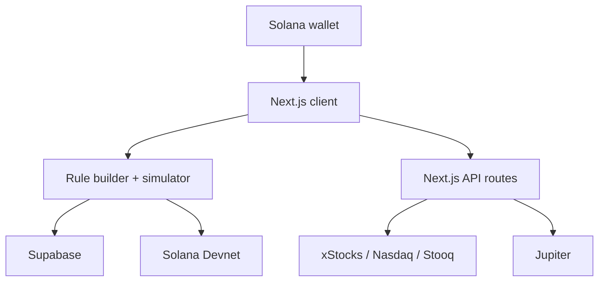

# StockFlow architecture

## System overview

## Main flows

### Allocation rule

The connected wallet address scopes the rule shown in the interface. A user builds percentage allocations, then saves the rule as a draft or active record in the `stockflow_rules` table. A wallet-specific local copy is kept as a prototype fallback.

### Market data

The client calls `GET /api/xstocks`. The server tries xStocks first, then Nasdaq and Stooq, and returns only the normalized asset name, ticker, price, source, and update time.

### Devnet verification

The client calculates the proposed distribution, creates a Solana Memo instruction, requests approval from the connected wallet, submits it to Devnet, and waits for confirmation. The memo proves the user completed the demo flow; it does not transfer investment funds.

### Jupiter preview

`POST /api/jupiter-preview` validates supported tickers and positive amounts, resolves each token mint, and requests routes sequentially to respect the configured API tier. The endpoint reports route readiness but deliberately does not return, sign, or submit the prepared transaction.

## Trust boundaries

| Boundary | Current behavior |
| --- | --- |
| Wallet | Keys remain in the user's wallet; StockFlow never receives a private key |
| Browser | Holds the publishable Supabase configuration and initiates wallet approval |
| Server routes | Hold the Jupiter key and proxy external API calls |
| Database | Must enforce access through Row Level Security |
| Third parties | Market and routing availability depends on external providers |

## Production hardening

Before handling real value:

- Authenticate wallet ownership with a signed challenge.
- Bind the authenticated wallet identity to database policies.
- Enable restrictive Row Level Security on every user-owned table.
- Add server-side request rate limiting and structured monitoring.
- Validate Solana addresses and cap request sizes and allocation counts.
- Add an execution service only after a dedicated smart-contract and security review.
